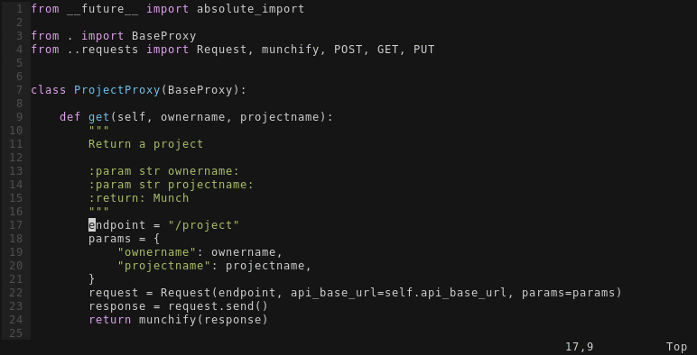
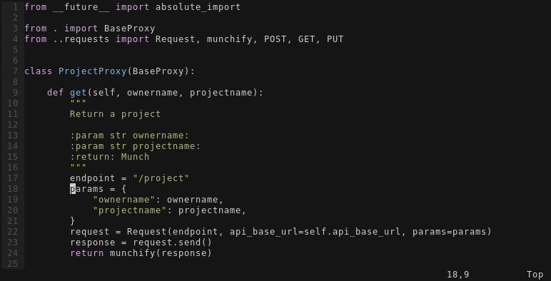

# Pagure support for vim-fugitive

## Requirements

- Vim with `+python` support

## Installation

Use [vundle][vundle], [pathogen][pathogen] or any other favourite way to install vim plugins.
First, don't forget to install [tpope/vim-fugitive][vim-fugitive] to provide `:Gbrowse`
command (and many more), and than `FrostyX/fugitive-pagure-vim` to provide [pagure][pagure] support.

    Plugin 'tpope/vim-fugitive'
    Plugin 'FrostyX/vim-fugitive-pagure'  " Enable :Gbrowse for pagure.io

## `:Gbrowse` in action

### Open a file

### Highlight the current line

### Highlight a selection

[vundle]: https://github.com/VundleVim/Vundle.vim
[pathogen]: https://github.com/tpope/vim-pathogen
[vim-fugitive]: https://github.com/tpope/vim-fugitive
[pagure]: https://pagure.io
